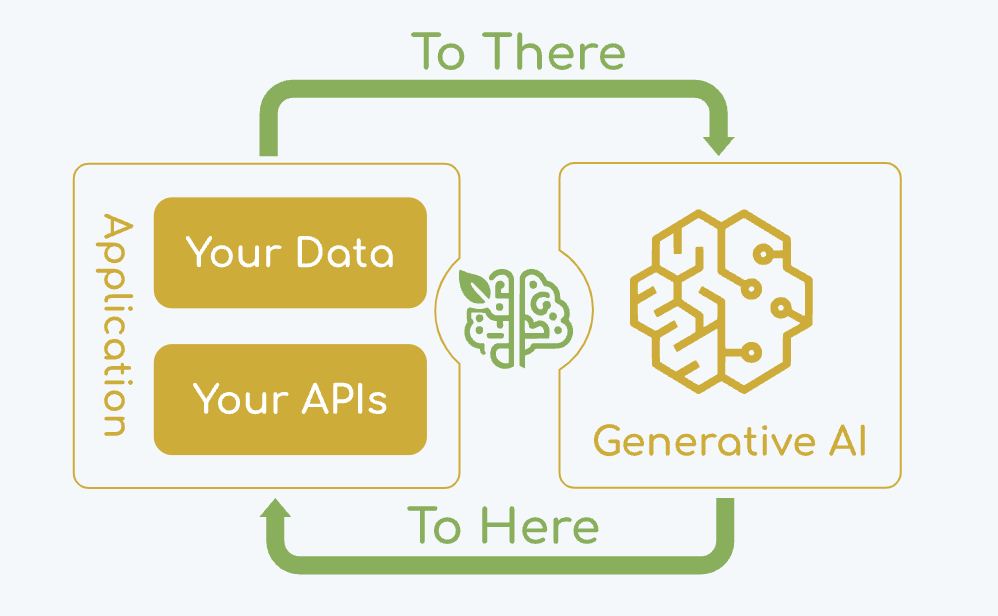
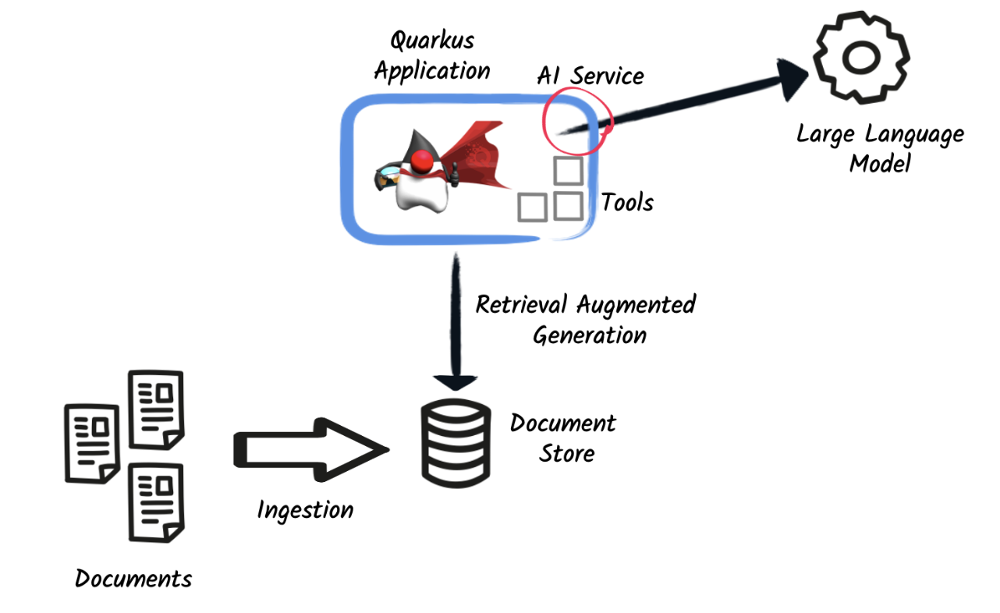

# Demystifying GenAI: Build A ChatGPT App with Vector Store

**Welcome!** This tutorial guides you through creating a generative AI application – **a ChatGPT-like model** – with the power of Vector Stores. **We'll start with Java**, providing a hands-on experience. Afterward, you can explore equivalent implementations in *Python and C#*.

**Review and deepen your understanding with the [Presentation Slides](https://bit.ly/42cVqoX)**.

## 1. Environment Setup

### 1.1. OpenAI API key

- [Create an OpenAI free account](https://platform.openai.com/signup/)) 
  - **You need to fund your account before generating an Open AI Key.** The minimum amount of **$5** should be sufficient. 
  - Verify your balance on the [billing dashboard](https://platform.openai.com/settings/organization/billing/overview). 
  - Make sure you see **Auto recharge is off** below your balance, so that it doesn't automatically charge you when you run out of balance.
- Generate OpenAI key.

Fine more information on the [OpenAI Account Setup Guide](https://coding-boot-camp.github.io/full-stack/ai/openai-account-setup-guide).

If you are interested in dealing with LLMs from HuggingFace, follow the instructions below:
- [Sign up for a new account in HuggingFace](https://huggingface.co/)
- [AI-ML-Workshops community organization](https://huggingface.co/AI-ML-workshops)
  - Feel free to join the new AI-ML-Workshops community organization for continuous information sharing and learning through the community, beyond the scope of this workshop

### 1.2. Container Runtimes 

Install Docker or Podman to run the DataStore or Database. In the **Quarkus** exercises, [Quarkus Dev Service for PostgreSQL](https://quarkus.io/guides/databases-dev-services) will be used to start the PostgreSQL container **automatically** based on your container runtime environment.

 - [Docker](https://www.docker.com/)
 - [Podman](https://podman.io/)

If you prefer to install the PostgreSQL database and pgVector extension locally, follow the instructions below:

- [PostgreSQL installation locally](https://www.postgresql.org/download/)
- [PgVector vector extension](https://github.com/pgvector/pgvector/blob/master/README.md)

## 2. Java Excerises

### 2.1. Prerequisites

- Preferably using an IDE such as IntelliJ, VS Code, (or any equivalent tooling). CLI is okay too but you may need a bit of experimentation.
- JDK 21.0 or later - Download it from [Adoptium](https://adoptium.net/)
- Maven 3.9.9 or higher (Gradle will be okay too if you prefer it)
_We'll be utilizing Spring AI and the online [spring initializr](https://start.spring.io) to generate the initial project 'frame', so the various library dependencies will be downloaded by default (including Spring Boot, Spring AI, Postgres with PgVector libraries)
- Conainer Runtimes: [Docker](https://docs.docker.com/get-started/get-docker/) or [Podman](https://podman.io/docs/installation)
- Spring AI reference materials can be found in [here](https://docs.spring.io/spring-ai/reference/)
- Quarkus Langchain4j reference materials can be found in [here](https://quarkus.io/guides/langchain4j/)

### 2.2. Spring AI Applications

- [HelloWorld with OpenAI](https://github.com/ai-ml-workshops/ai-openai-helloworld)
- [HelloWorld with Ollama](https://github.com/ai-ml-workshops/ai-ollama-helloworld)
- [Spring AI with RAG and PgVector (written by Dan Vega)](https://www.danvega.dev/blog/2024/10/22/getting-started-with-spring-ai-rag#building-your-first-rag-application)

### 2.3. Quarkus Langchain4j Applications

- [Quarkus LangChain4j Generative AI Chatbot](https://github.com/ai-ml-workshops/ai-quarkus-langchain4j-chatbot)
- [Document Retrieval for Language Models with PostgreSQL pgVector store](https://github.com/ai-ml-workshops/ai-quarkus-langchain4j-doc-retrieval)

## 3. Python Excerises

### 3.1. Prerequisites

- Python 3 (consider installing with python virtual environment like pyenv)
- Python IDE of your choice (Visual Studio Code, PyCharm, etc.)
- Docker or Podman
- OpenAI API key (see instructions below)
- Langchain API key to use LangSmith for debugging (optional). To create account and API key, refer to these [instructions](https://docs.smith.langchain.com/administration/how_to_guides/organization_management/create_account_api_key#create-an-account)
- If you're using Windows, install Git Bash so that you can run the commands below (if using VSCode you can select Git Bash after starting the integrated terminal)

### 3.2. Python AI Applications

- [HelloWorld and The Meal Planner Apps](https://github.com/ai-ml-workshops/meal-planner-chatbot)

## 4. C# Excerises

### 4.1.Prerequisites

- Visual Studio 2022
- .NET 8
- OpenAI API key (see instructions below)

### 4.2. C# AI Applications

- [OpenAI Hello World example with C#](https://github.com/ai-ml-workshops/openai-csharp-helloworld)
